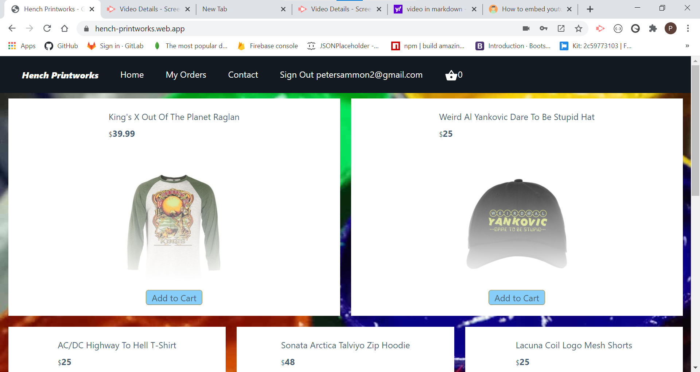

# Hench Printworks

## Description

Full Stack ecommerce application for a mock Screen Printing shop that features select apparel. This application was the final project of an intense 6 month, remote Full Stack Bootcamp at the University of New Hampshire. Some of the features that this application has are the following:

- login authentication
- protected routes
- payment processing
- contact submission form

## Technologies

- Firebase
- Express
- React
- Node
- Cloud Functions
- Context Api
- Stripe API
- Material UI
- TailwindCSS
- Axios
- Moment
- UUID
- Cors
- Dotenv

## Demonstration

## Future Development

- Replace Context API with redux to include alerts whenever an item is added to cart or when purchase is made
- include email receipts whenever a purchase is made using stripe
- Incorperate Refunding functionality with stripe

## Developer

Peter Sammon
